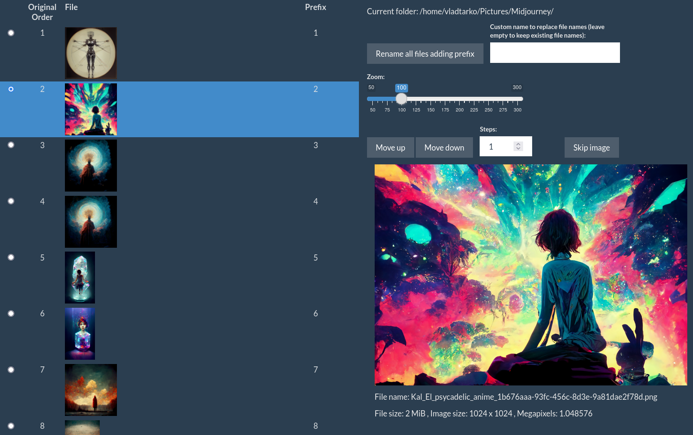

# Description

A Shiny R script that allows you to easily re-arrange the images in a folder. 

Once you've manually rearranged the images in the desired order, the script can rename all the files by adding a numeric prefix, such that they will appear in the desired order in file explorers and other programs. This can be used a preparation step for making a slideshow, e.g. in Kdenlive (or even directly in the command line with ffmpeg).

The script can rename the files by adding the numeric prefix to the existing file names, or can use a different custom name for all files. The script also allows you to mark as 'skip' some of the files, and these will have the 'skip_' prefix to them, such that they will appear at the end in a file manager (so you can them easily move them to some other folder).

# Use

Go to a desired folder in the terminal and call `image-arrange.r`. The shiny app will open in your browser. Closing the browser window will close the program.

Alternatively, you can call `image-arrange.r /path/to/my/images` from any other location, where `/path/to/my/images` is the folder with the images you want re-ordered.

You can also set it up to be available when you right-click in your file manager.

# Installation

## Pre-requisites

You need the following:

- R. Install from [R Project](https://cloud.r-project.org/) or install `r-base` from your OS package manager.
 
- [ImageMagick](https://imagemagick.org/script/download.php). You probably already have this installed. The legacy version 6 works fine. If you don't have it, you can also install `imagemagick` from your OS package manager.

- The following R packages. Run the following in the terminal after you've installed R.

      Rscript -e "install.packages(c('tidyverse', 'knitr', 'scales', 'glue', 'shiny', 'shinythemes', 'reactable', 'htmltools', 'magick', 'exiftoolr'), repos='https://cran.rstudio.com')"

- Install `exiftool` by running the follwing in the terminal:

      Rscript -e "exiftoolr::install_exiftool()"

## Installation

Copy the file `image-arrange.r` in a folder that's in your $PATH. Set file permissions to executable by running `chmod +x image-arrange.r` in the terminal.

For example, you may have a folder `~/.scripts` that you've added to the $PATH. You can put it in there alongside other scripts you may have.

If you're using Gnome, you can put it in `~/.local/share/nautilus/scripts/` and it will be available when you right-click on a file in the file manager (in the "Scripts" menu).

# Known issues

If you're trying to load a folder with a lot of pictures, or a lot of large pictures, you may run into ImageMagick memory and disk policy restrictions. These restrictions are set very low compared to most modern hardware, and your computer probably allows them to be much larger.

You can change ImageMagick policy by editing the file `/etc/ImageMagick-6/policy.xml` (or 7 or higher depending on which version of ImageMagick you're using). Look for the `<policymap>` and change the following:

    <policymap>
      <policy domain="resource" name="memory" value="10GiB"/>
      <policy domain="resource" name="disk" value="25GiB"/>
